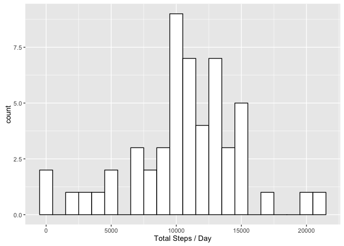
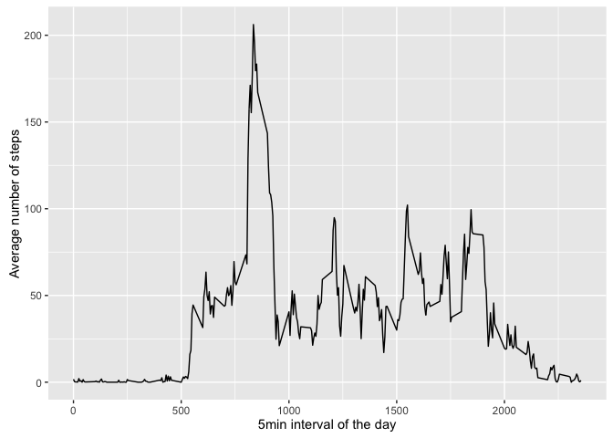
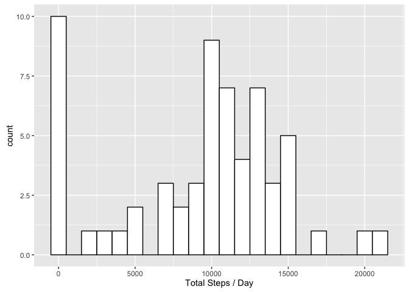
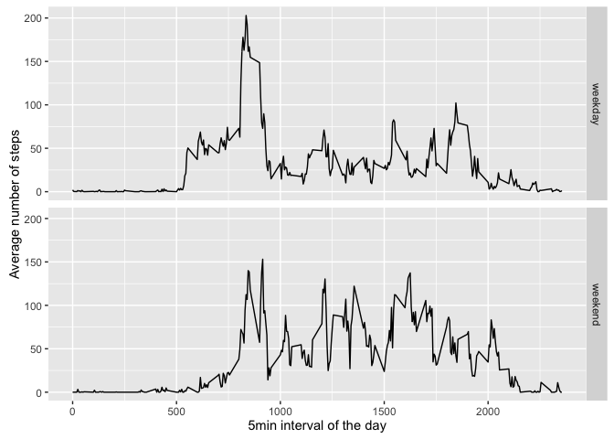

# Reproducible Research: Peer Assessment 1

## Loading and preprocessing the data

The data set is part of a [Git repository][1] from Roger Peng. After forking/cloning we can read the data set as follows:


```r
if (!file.exists("activity.csv")) {
    unzip("activity.zip")
}
mydata <- read.csv("activity.csv", colClasses=c("integer", "Date", "integer"))
```

The data set contains the steps, the date and the 5 minute interval


```r
str(mydata)
```

```
## 'data.frame':	17568 obs. of  3 variables:
##  $ steps   : int  NA NA NA NA NA NA NA NA NA NA ...
##  $ date    : Date, format: "2012-10-01" "2012-10-01" ...
##  $ interval: int  0 5 10 15 20 25 30 35 40 45 ...
```

[1]: <http://github.com/rdpeng/RepData_PeerAssessment1>


## What is mean total number of steps taken per day?

The activity spans from days with no (measured) activity to some 20000+ step days:


```r
steps_day <- aggregate(steps ~ date, data = mydata, sum, na.rm=TRUE)

library(ggplot2)
print (ggplot(steps_day, aes(x=steps)) +
       geom_histogram(binwidth=1000, colour="black", fill="white") +
       xlab("Total Steps / Day"))
```

<!-- -->

The median and mean of steps per day over the whole dataset is ...


```r
mymedian <- summary(steps_day$steps)[[3]]
mymean <- summary(steps_day$steps)[[4]]
```

... 10760 for the median and 10770 for the mean.


## What is the average daily activity pattern?

We are interested if there is a pattern of activity over the day. For this we average every 5 minute interval step value over all the days the activity was measured


```r
day_avg <- aggregate(steps ~ interval, data = mydata, mean, na.rm=TRUE)
```

We print the average step value against the 5 minute interval of the day: 


```r
print( ggplot(day_avg, aes(x=interval, y=steps)) + geom_line() +
       xlab("5min interval of the day") +
       ylab("Average number of steps"))
```

<!-- -->

(Note: the interval is actually in the format hhmm, i.e. after 1155 it jumps to 1200. This creates some artifact but is not seriously altering the graph)


The 5 minute interval with the largest number of steps is


```r
subset(day_avg, steps == max(day_avg$steps))$interval
```

```
## [1] 835
```


## Imputing missing values

Let us investigate how many NA values exist. First we do a quick check that the date and interval values do not contain any NA:


```r
anyNA(mydata$date)
```

```
## [1] FALSE
```

```r
anyNA(mydata$interval)
```

```
## [1] FALSE
```

We know there are NA values in the *step* field though. The total number is


```r
total_steps_na <- sum(is.na(mydata$steps))
total_steps_na
```

```
## [1] 2304
```

In fact some days exist where all step data is NA:


```r
testA <- tapply(mydata$steps, mydata$date, sum)
total_days_na <- sum(is.na(testA))
total_days_na
```

```
## [1] 8
```

The total number of NA values in the step column is 2304. Actually, 8 days with 288 5 minute intervals per day is 2304, i.e. all the NA values come from these days with no data at all. 


With such large gaps, faking the data for several days is a questionable strategy. For our curiosity we investigate if filling the NA values with zeros makes any significant difference to the data we already know.


```r
newdata <- mydata
newdata$steps[is.na(newdata$steps)] <- 0
```

Now let us see how this is changing the mean, median and histogram.


```r
new_steps_day <- aggregate(steps ~ date, data = newdata, sum, na.rm=TRUE)

new_mymedian <- summary(new_steps_day$steps)[[3]]
new_mymean <- summary(new_steps_day$steps)[[4]]

library(ggplot2)
print (ggplot(new_steps_day, aes(x=steps)) +
       geom_histogram(binwidth=1000, colour="black", fill="white") +
       xlab("Total Steps / Day"))
```

<!-- -->

The new median and mean of steps per day now is
10400 and 9354.


Obviously adding fake data for several days increases one bin in the histogram; in our case the zero bin. Also the median and mean should go down, with the median being more robust to such fake data.


## Are there differences in activity patterns between weekdays and weekends?

Another interesting question about the activity data is if there are differences in activity patterns between weekdays and weekends?

We create a new variable that differentiates between weekday and weekend


```r
newdata$day <- factor(grepl("^S", weekdays(newdata$date)),
                      levels=c(FALSE, TRUE),
                      labels=c("weekday", "weekend"))
```

This allows us to plot the number of steps averaged over either the weekdays or the weekend, against the 5 minute interval.


```r
new_day_avg <- aggregate(steps ~ interval + day, data = newdata, mean, na.rm=TRUE)
print( ggplot(data=new_day_avg, aes(x=interval, y=steps)) +
       facet_grid(day ~ .) + geom_line() +
       xlab("5min interval of the day") +
       ylab("Average number of steps"))
```

<!-- -->

As we can see the activity is relatively low during the work hours for Monday to Friday while walking activity is elevated for most of the daylight hours of the weekend. Interesting is the peak every morning during working days.
